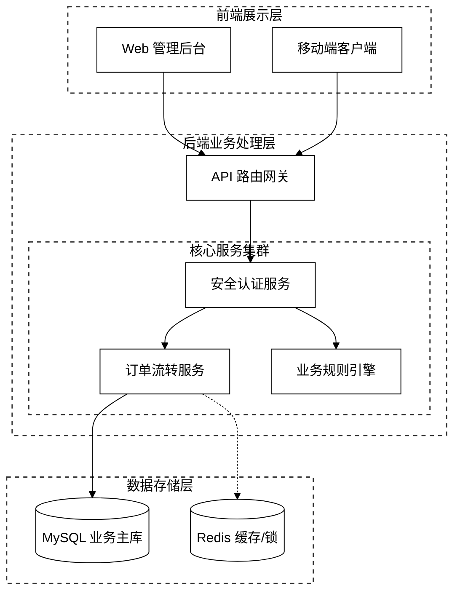
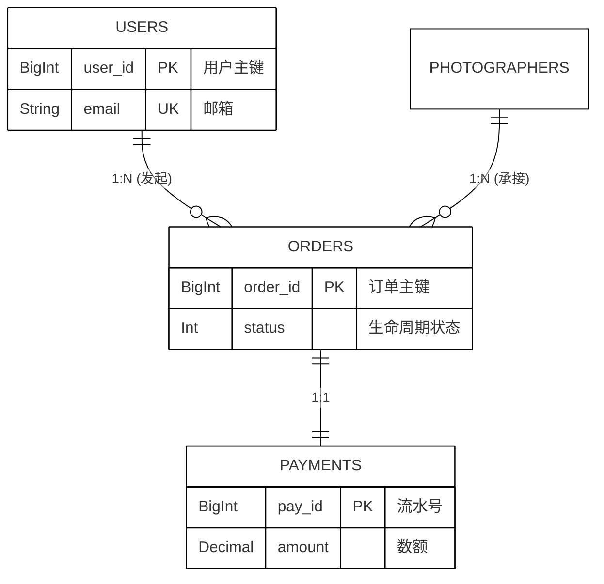
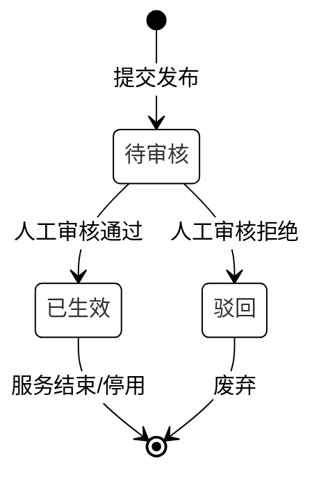
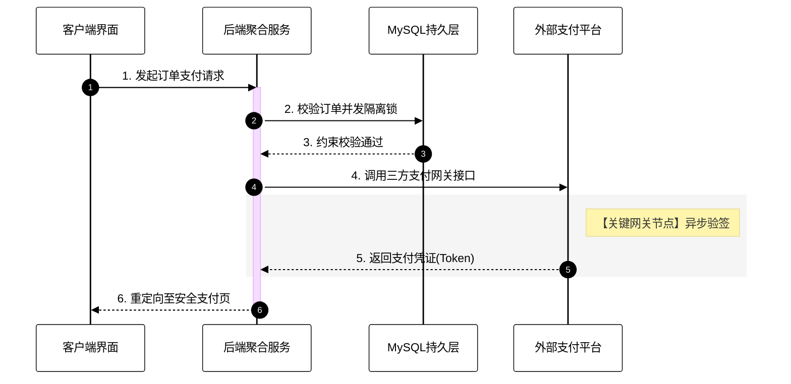

# 学术化 Mermaid 图形生成指南

> 本工作流/技能指南规定了如何使用 Mermaid 代码生成符合严格学术论文要求的高质量、专业化机制图与架构图，彻底替代复杂的手工图像编辑过程。

## 触发场景
- 当用户要求在技术文档、开题报告、毕业设计或学术论文中补充插图时。
- 当系统需要生成清晰严谨的“系统总体架构图”、“业务时序图”、“ER实体关系图”、“状态机生命周期图”时。
- 当现有的系统图显得过于随意（带有鲜艳主题色、排版混乱、标注不清）而需要转为学术格式时。

---

## 核心设计规范与约束

符合学术标准的 Mermaid 图表**必须**严格遵守以下 5 项特征：

### 1. 黑白配色，简洁专业
- **禁止**使用 Mermaid 默认的蓝/黄/绿鲜艳配色。
- **配置注入**：必须在图首行注入 `%%{init: {'theme': 'base'... }}%%` 指令，强制图表为白底、黑边框、黑字、黑线、可选的极简浅灰底色。

### 2. 清晰的层次分隔（虚线分隔各层）
- 使用 `subgraph` 划分逻辑层次（如：展示层、业务层、数据层）。
- 辅以 `classDef stroke-dasharray` 将分层包裹框修改为规范的**虚线框**，避免包裹框抢夺主体模块的视觉焦点。

### 3. 标准化图形符号
- **模块/组件**：使用标准的矩形 `[组件名称]` 或圆角矩形 `(组件名称)`。
- **数据源/存储媒介**：强制使用学术通用的圆柱体符号 `[(数据库名称)]` 标识持久化层。
- **网关/网关节点**：菱形或平滑多边形。

### 4. 规范的箭头连接
- 数据/控制流动：统一采用标准实线的黑侧单向箭头 `-->`。
- 异步消息/弱依赖/缓存击穿：使用虚线箭头 `-.->`。
- 避免箭头飞线交叉，必要时通过增加隐式排版节点或控制树的深入方向（`graph TD` 俯视或 `graph LR` 平视）进行梳理。

### 5. 层次标签明确标注
- 每个层次（子图）的左上/中上部必须有明确功能定位的标注，如 `[表现层 presentation layer]`。
- 模块名应直指系统功能或组件专名，杜绝无意义的代称。

---

## 学术级图表实战模板库

在响应用户“生成一篇符合论文要求的图（如架构图）”的请求时，应当直接套用或变体下方模板生成代码。

### 模板 A：分层架构拓扑图 (系统总体架构)

典型的四层结构架构视图，实现了规范的虚线图层框与黑白学术风：

### 模板 B：E-R 数据实体关系图

学术 E-R 图更侧重关系基数与实体属性。学术版需要强制白底黑字。

### 模板 C：系统级生命周期状态图 (状态机)

用于表现严格的状态转换，在“流转引擎”、“事务处理状态闭环”类论文章节必备。

### 模板 D：规范预约时序图 (序列交互图)

用于描述涉及三方组件、微服务内部、或者核心交易机制的同步/异步过程交互。

## AI 执行要求
在应用此 Skill 时，AI 需要执行以下动作：
1. **抓取原始述求**：仔细提取用户代码或文字中提炼模块（前、后、数据等）、实体关系或调用路径。
2. **选择渲染图格式**：根据描述类型，判定属于组件图结构(graph TD) 还是 控制流 (sequence/state)。
3. **强制混入 CSS 层**：把 `%%{init: ...}%%` 学术模板投喂到代码的最前沿。
4. **验证符合论文 5 准则**：检查 `[]` (实体), `[()]` (DB圆柱), `虚线`, `单色视觉` 分离呈现状况后再进行输出。
5. **强制全态 AI 生图策略 (PNG 生成)**：在用户明确要求使用 `generate_image` 工具直接生成带有实际文字内容的图表时，请遵循以下最新策略，绝对不允许退避并生成“无字纯几何图形”：
   - **提取凝练文本短词**：由于模型在渲染复杂长句容易发生文字错乱，构思提示词时，必须将模块名称进行最精简凝练（支持提供中文字符，必要时加上简短精准的英文辅助），如把“订单状态生命周期”精简为“订单流转(Order State)”。
   - **强硬注入文本指令**：提示词中必须直接且强硬地规定：“图内的核心方框或节点上，必须要端正地渲染写出下列文字，绝不能省略或留白”。
   - **放宽容错与多次试错**：系统理解模型写字时可能会有瑕疵或拼写失误，但必须迎难而上。为了获得更好效果，允许且推荐在同一次需求中运用工具并行**多次声成**（提供多样化候选给用户选择），从而选出文本更清晰准确、排版最具论文范儿的一张图。
