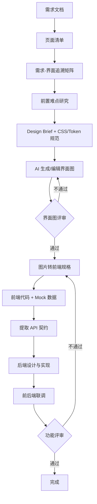

# AI 前端先行开发工作流

> 目标：通过"AI生图 → 前端代码 → API契约 → 后端实现"的流程，减少返工，确保前后端一致性

## 流程概览

## 审美急救包 Skill 路由

UI-facing feature 进入本流程时，按任务类型组合以下 skill：

| 阶段 | 必用/可选 Skill | 作用 |
|------|-----------------|------|
| 需求映射 | `requirements-design-template` | 在需求阶段记录品牌参照、反参照、设计方差、动效强度、信息密度 |
| 设计方向 | `impeccable` + `design-taste-frontend` | 建立整体审美、信息架构、视觉层级、token 和 anti-slop 约束 |
| 品牌风格 | `brand-design-md` | 用户要求 Apple/Stripe/Notion/Linear/Claude 等风格时拉取 DESIGN.md |
| UI 工程基线 | `baseline-ui` | 约束 Tailwind、组件 primitive、状态覆盖、响应式和加载骨架 |
| 图标 | `better-icons` | 搜索并提取真实 SVG 图标，避免低质量自绘图标 |
| 动效 | `motion-ai-kit`（如已安装）或 `fixing-motion-performance` | 规划动画并检查性能、reduced motion、layout thrashing |
| 可访问性 | `fixing-accessibility` | 键盘、焦点、ARIA、语义、表单标签 |
| 页面交付 | `fixing-metadata` | title/meta/OG/social card/favicon |

## 阶段产出物

| 阶段        | 产出物                 | 评审点                     |
| ----------- | ---------------------- | -------------------------- |
| 1. 需求映射 | 页面清单 + 需求-界面追溯矩阵 | 每条需求是否覆盖到界面、状态、字段、接口和验收 |
| 2. 难点研究 | difficulty-research | 高风险问题是否已在编码前研究 |
| 3. 设计规范 | Design Brief + CSS/Token 规范 | 生图输入是否足够精确 |
| 4. AI 生图 | 界面设计图（含多状态） | 状态是否完整、细节是否充分 |
| 5. 图片评审 | ui-image-review | 需求、状态、CSS 是否匹配 |
| 6. 图转规格 | image-to-frontend-spec | 图片是否转成可编码前端规格 |
| 7. 前端开发 | 前端代码 + Mock 数据 | 交互是否符合预期 |
| 8. API 契约 | OpenAPI/接口文档 | 字段命名、数据结构是否一致 |
| 9. 后端开发 | 后端代码 + 真实 API | 接口是否符合契约 |
| 10. 联调验收 | 完整功能 | 端到端流程是否通畅 |

## 常见问题与解决方案

| 问题         | 表现                             | 解决方案             | 模板文件                                     |
| ------------ | -------------------------------- | -------------------- | -------------------------------------------- |
| 界面状态不全 | 只有正常态，缺空态/加载态/错误态 | 强制使用状态覆盖清单 | #[[file:templates/page-spec-template.md]]    |
| 细节不够     | 缺字段校验、操作反馈、数据格式   | 强制填写字段规格表   | #[[file:templates/page-spec-template.md]]    |
| 前后不一致   | 命名/状态值/数据结构不一致       | 建立一致性检查清单   | #[[file:templates/consistency-checklist.md]] |
| 需求没落界面 | 写完需求后不知道在哪个页面实现 | 需求-界面追溯矩阵 | `requirement-interface-matrix.md` |
| 编码时才研究 | 到实现阶段才发现难点 | 前置难点研究 | `difficulty-research.md` |
| 图片不能编码 | 图好看但缺 CSS/组件/状态规格 | 图转前端规格 | `image-to-frontend-spec.md` |

## 相关模板

使用时请引用对应模板：

| 模板           | 用途                   | 引用方式                   |
| -------------- | ---------------------- | -------------------------- |
| 页面规格模板   | 定义单个页面的完整规格 | `#page-spec-template`    |
| 一致性检查清单 | 评审时检查前后端一致性 | `#consistency-checklist` |
| AI生图提示词   | 生成界面设计图的提示词 | `#ai-ui-prompts`         |
| API契约模板    | 从前端提取后端接口规范 | `#api-contract-template` |
| 需求-界面矩阵 | 需求到界面、状态、字段、接口、验收的追溯 | `requirement-interface-matrix.md` |
| 难点研究模板 | 编码前研究高风险难点 | `difficulty-research.md` |
| 图转规格模板 | 把通过评审的图片转成前端实现规格 | `image-to-frontend-spec.md` |

## 评审检查清单

### 界面评审 ⚠️ 必查

- [ ] 所有必要状态都有设计图（正常/空/加载/错误）
- [ ] 每条 P0/P1 需求都能在界面图中找到证据
- [ ] 边界场景都有处理方案（超长/超多/为空）
- [ ] 字段规格完整（类型/格式/校验/错误提示）
- [ ] 操作反馈明确（成功/失败/确认）
- [ ] 权限视图区分清晰
- [ ] CSS / Token 与 Design Brief 一致
- [ ] 图片没有新增需求之外的功能

### 一致性评审 ⚠️ 必查

- [ ] 命名一致性：同一概念在所有页面使用相同名称
- [ ] 状态值一致性：前后端状态值映射明确
- [ ] 交互一致性：相同操作在所有页面行为一致

### API契约评审 ⚠️ 必查

- [ ] 字段命名与前端一致
- [ ] 数据类型与前端一致
- [ ] 错误码定义完整

## 返工原因 Top5

| 排名 | 返工原因            | 预防措施             |
| ---- | ------------------- | -------------------- |
| 1    | 缺少空态/错误态设计 | 强制填写状态覆盖清单 |
| 2    | 字段校验规则不明确  | 强制填写字段规格表   |
| 3    | 前后端命名不一致    | 建立命名一致性表     |
| 4    | 操作反馈不明确      | 强制填写操作反馈表   |
| 5    | 权限控制遗漏        | 强制填写权限视图表   |
