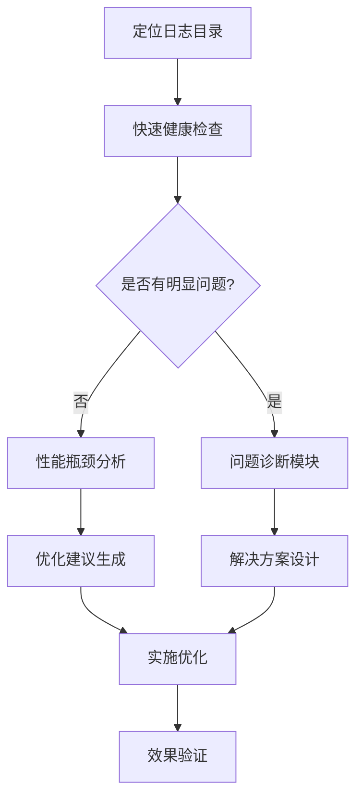
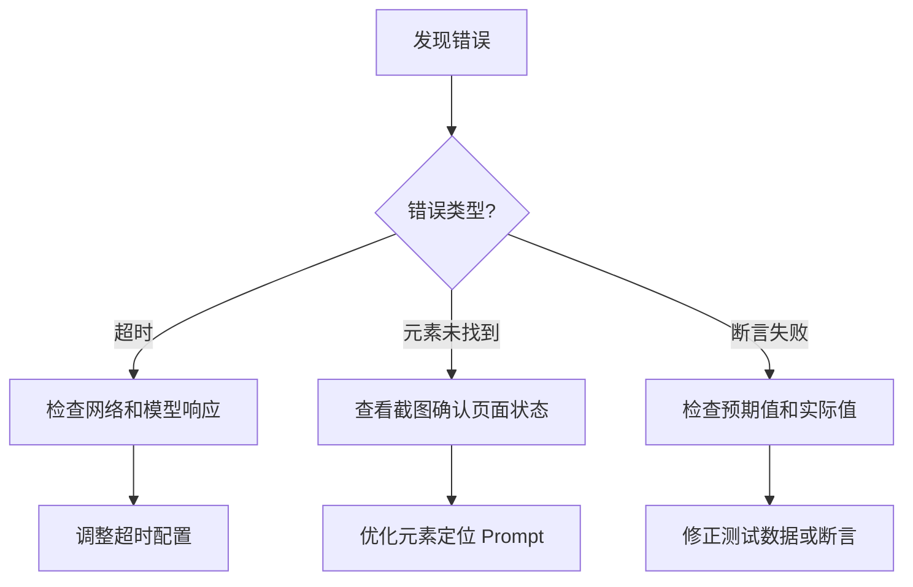

# Midscene 日志分析优化工作流

> 通过系统化分析日志，识别性能瓶颈，优化测试效率，快速定位和解决问题。

---

## 工作流概览



---

## 第一步：日志目录定位与文件说明

Midscene 运行产物存储在 `midscene_run/` 目录下：

```text
midscene_run/<timestamp>/
├── log/
│   ├── console.log          # 核心流程日志，优先分析
│   ├── ai-profile-stats.log # AI 性能统计，含 token 和耗时
│   ├── ai-call.log          # AI 调用详情，含推理过程
│   ├── agent.log            # Agent 执行细节
│   └── cache.log            # 缓存操作日志
├── report/
│   └── *.html               # 可视化报告
└── run-info.json            # 运行元数据
```

---

## 第二步：快速健康检查

### 2.1 检查测试结果摘要

在 `console.log` 末尾查找测试摘要：

```text
════════════════════════════════════════════════════════════
  测试执行摘要 (Test Execution Summary)
════════════════════════════════════════════════════════════
  总用例数 (Total):    6
  通过 (Passed):       6  ✓
  失败 (Failed):       0  
  执行时间 (Duration): 10m 56.6s
════════════════════════════════════════════════════════════
```

### 2.2 关键指标基准线

| 指标 | 健康值 | 警告值 | 危险值 |
|:---|:---|:---|:---|
| 单用例耗时 | < 60s | 60-120s | > 120s |
| AI 调用耗时 | < 8s | 8-15s | > 15s |
| 导航节省率 | > 30% | 15-30% | < 15% |
| 缓存命中率 | > 50% | 20-50% | < 20% |

---

## 第三步：性能瓶颈识别

### 3.1 AI 调用耗时分析

从 `ai-profile-stats.log` 提取性能数据：

```text
# 格式: timestamp, model, mode, prompt-tokens, completion-tokens, total-tokens, cost-ms
[时间] model, ep-xxx, mode, doubao-vision, prompt-tokens, 1302, completion-tokens, 714, total-tokens, 2016, cost-ms, 13185
```

**关注点**：
- `cost-ms > 15000`：调用过慢，检查网络或模型负载
- `completion-tokens > 5000`：响应过长，需优化 prompt
- `prompt-tokens > 3000`：输入过大，考虑精简上下文

### 3.2 高耗时操作识别

搜索 `console.log` 中的 AI 操作日志：

```bash
# 查找耗时超过 15 秒的操作
grep -E "duration.*[0-9]{5}" console.log
```

常见高耗时操作模式：

| 操作类型 | 正常耗时 | 原因分析 |
|:---|:---|:---|
| `aiTap` | 5-10s | 元素定位 + 点击确认 |
| `aiQuery` | 3-8s | 页面分析 |
| `aiInput` | 10-18s | 键盘输入 + 验证 |
| `aiWaitFor` | 依赖页面 | 等待条件满足 |

### 3.3 Token 消耗异常检测

```bash
# 查找异常高的 completion tokens
grep "completion-tokens" ai-profile-stats.log | awk -F',' '{print $8}' | sort -n | tail -10
```

**异常阈值**：单次 `completion-tokens > 5000` 应检查：
- AI 响应是否陷入循环
- Prompt 是否过于开放

---

## 第四步：效率优化建议

### 4.1 批量验证策略

**现有模式**（已实现）：
```text
BatchVerifier: 批量验证完成
  totalElements: 21, aiCallCount: 3, totalDuration: 18650ms
```

**优化建议**：
- 每批元素数控制在 10 个左右
- 使用 `useFreeze: true` 冻结页面上下文
- 相似元素合并为一次查询

### 4.2 状态导航优化

**识别重复导航**：
```text
[StateNavigator] 当前状态: unknown (置信度: 30%, 尝试 1/2)
[StateNavigator] 未找到从 unknown 到 main_page 的路径，等待...
```

**优化建议**：
- 添加更多状态识别规则
- 提高 `unknown` 状态的识别覆盖率
- 使用 `NavigationOptimizer` 跳过已知位置

**效果指标**：
```text
NavigationOptimizer: 节省导航=2, 总请求=5, 节省率=40.0%
```

### 4.3 Prompt 精简建议

**当前模式**（可优化）：
```json
{
  "prompt": "分析当前 APP 页面状态，返回 JSON:\n{\n  \"hasSplashScreen\": ..., \"hasWelcomeGuide\": ..., ... }"
}
```

**优化后**：
- 减少描述性文字，使用简洁的字段名
- 预定义返回格式，减少 AI 推理负担
- 使用缓存避免重复检测

---

## 第五步：问题诊断

### 5.1 常见故障模式速查表

| 现象 | 日志关键词 | 可能原因 | 解决方案 |
|:---|:---|:---|:---|
| AI 调用超时 | `AI 调用超时`, `timeout` | 网络慢/模型负载高 | 增加超时时间，添加重试 |
| 状态识别失败 | `unknown`, `置信度: 30%` | 页面状态未覆盖 | 添加新状态规则 |
| 元素找不到 | `Element Not Found` | Prompt 不准确/页面未加载 | 优化 prompt，增加等待 |
| SmartWait 失败 | `达到最大重试次数` | 页面状态不稳定 | 增加 stabilityCount |
| 导航循环 | `超过最大尝试次数` | 状态转换规则缺失 | 添加转换规则 |

### 5.2 错误根因分析流程



### 5.3 日志关键词速查

```bash
# 快速定位错误
grep -E "\[ERROR\]|\[WARN \]" console.log

# 查找超时
grep -i "timeout" console.log

# 查找状态问题
grep "unknown" console.log

# 查找重试
grep -i "retry" console.log
```

---

## 第六步：最佳实践

### 6.1 日志分析标准流程

1. **快速扫描**：查看测试摘要，确认通过/失败数
2. **定位问题**：搜索 `[ERROR]`、`[WARN ]` 关键词
3. **时间分析**：检查各阶段耗时，识别瓶颈
4. **详细追踪**：结合 HTML 报告查看截图和时间线

### 6.2 性能监控指标

| 指标 | 采集位置 | 监控建议 |
|:---|:---|:---|
| 单用例耗时 | 测试摘要 | 趋势监控，超过阈值告警 |
| AI 调用耗时 | ai-profile-stats.log | P99 不超过 15s |
| Token 消耗 | ai-profile-stats.log | 单次不超过 5000 |
| 导航节省率 | console.log | 保持 > 30% |
| 缓存命中率 | console.log | 目标 > 50% |

### 6.3 持续改进建议

- **定期分析**：每周分析一次日志趋势
- **基准对比**：建立性能基准，对比历史数据
- **规则更新**：根据新页面状态更新识别规则
- **缓存维护**：定期清理无效缓存

---

## 相关 Skills

- `skills/midscene-log-analysis/SKILL.md` - 基础日志分析
- `skills/midscene-framework/SKILL.md` - 框架开发指南
- `skills/error-handling/SKILL.md` - 错误处理技巧
