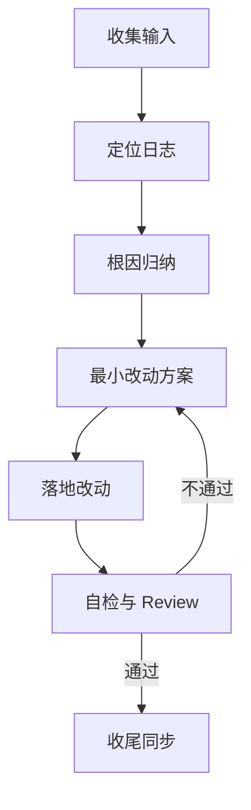

# Midscene Fix Review

> 定位 midscene_run/... 根因并给出最小改动修复与验证路径，要求自我迭代并通过 Review 标准。

---

## 工作流概览



---

## 目标与约束

- 聚焦“最小改动、兼容现有策略”的修复路径，优先改动已有模块而非新建文件。
- 若写代码，必须为新函数添加函数级注释，保持 UTF-8 编码。
- 需要验证逻辑时：在 `test-temp/` 创建临时测试文件并使用测试框架运行，完成后删除。
- 每轮对话结束：更新 `README.md` 的任务列表，并记录关键结论到记忆系统。
- 项目内最佳实践清单：`openspec/specs/skill-governance/spec.md`。

---

## 必备输入

- `midscene_run/<run_id>` 路径
- 用例名
- 期望行为
- 已知结论与可疑模块

---

## 日志定位与证据链

按顺序读取并建立时间线：

1. `log/console.log`（beforeAll/BatchVerifier/aiWaitFor/handlePopups）
2. `log/ai-call.log`（aiQuery/aiTap/JSON 响应结构）
3. `log/android-device.log` 与 `log/img.log`（截图通道异常）

---

## 根因归纳（四类）

- **解析层**：aiQuery 返回格式与解析习惯不一致（如缺少 `data` 包裹）。
- **预操作策略**：缓存跳过 preAction 后未验证目标状态，缺少强制重试。
- **弹窗策略**：触发时机过宽导致副作用或遗漏关键节点弹窗。
- **设备通道**：`Screenshot returned no data` 影响识别与定位稳定性。

---

## 最小改动方案模板

输出必须指明：
- 文件路径
- 关键函数名
- 改动点
- 风险与验证路径

---

## 示例：BatchVerifier 断言为空

**日志证据**：
```text
[WARN ] BatchVerifier: 批量查询结果为空，使用默认值
```

**推断**：
ai-call.log 返回 JSON 数组，但解析层只读取 `data` 字段，导致结果被丢弃。

**最小修复**：
- `src/optimization/BatchVerifier.ts` → `buildBatchQueryPrompt` 统一输出 `{ "data": [...] }`
- 解析失败时禁止默认“通过”，改为显式失败或回退重试

**验证**：
单跑相关用例，确认 `verify_not_exists` 不再误通过。

---

## 自检与 Review 通过标准

- 结论与证据闭环（日志时间戳、文件路径、关键语句对齐）。
- 修复方案为最小改动且可验证，有明确验证路径。
- 若涉及代码改动：函数级注释齐全、无新增任务型文档、测试临时文件已删除。
- README 任务列表已更新，关键结论已记录到记忆系统。
- 不通过则回到“最小改动方案模板”重新迭代。

---

## 输出要求（简洁）

- 结论（1-2 句）→ 证据（日志文件+时间戳）→ 影响（失败路径）
- 最小修复方案 → 验证步骤
- 若需改动：列出文件路径与关键函数名

---

## 相关 Skills

- #midscene-log-analysis
- #midscene-framework
