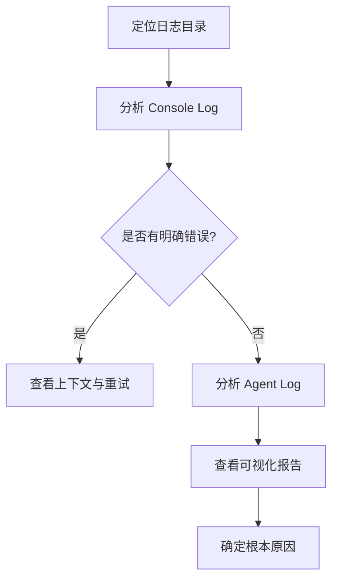

# Midscene 日志分析工作流

> 通过分析 Midscene 运行日志（console.log, agent.log, reports），快速定位测试失败的根本原因。

---

## 工作流概览



---

## 第一步：定位日志目录

Midscene 的运行产物通常存储在 `midscene_run/` 目录下，以时间戳命名。

**目录结构示例**：
```text
midscene_run/
└── 2026-01-19_17-57-35-7a58cpyz/
    ├── log/
    │   ├── console.log        # 核心日志，包含流程、警告和错误
    │   ├── agent.log          # 详细日志，包含 AI 思考、截图尺寸、DOM 信息
    │   └── ...
    ├── report/
    │   └── *.html             # 可视化测试报告
    └── run-info.json          # 运行元数据
```

---

## 第二步：分析 Console Log

`console.log` 是排查的第一入口，重点关注以下关键词：

- `[WARN]`, `[ERROR]`
- `timeout`, `ActivityTimeout`
- `SmartWait`, `fallback`
- `aiWaitFor`, `aiQuery`, `aiAssert` 

### 关键检查点

1. **测试流程中断点**：
   查找最后的日志时间点，确认测试是在哪个步骤停止的。
   ```text
   [ActivityTimeout] 活动: aiWaitFor failed @ ...
   ```

2. **AI 调用超时**：
   如果出现 `AI 调用超时`，通常意味着页面没有在规定时间内达到预期状态，或者 AI 无法识别目标元素。
   ```text
   [WARN ] AI 调用超时 ... error: "AI 调用超时: aiWaitFor 操作在 5000ms 内未完成"
   ```

3. **SmartWait 重试**：
   检查 `SmartWait` 是否达到最大重试次数。
   ```text
   [ERROR] SmartWait 达到最大重试次数 ... retryCount: 2
   ```

---

## 第三步：分析 Agent Log (详细调试)

当 `console.log` 信息不足时，查看 `agent.log` 获取更底层的执行细节。

### 关注内容

1. **Action Plan**：
   AI 实际规划了什么动作？
   ```text
   actionPlan {
     type: 'Tap',
     param: { locate: { prompt: '登录按钮' } }
   }
   ```

2. **Screenshots & Context**：
   查看日志中是否有截图尺寸调整或 Context 解析的记录，确认页面是否正确加载。
   ```text
   [... will get screenshot scale ...]
   [... computedScreenshotScale 2.74 ...]
   ```

---

## 第四步：查看可视化报告

打开 `report/*.html` 文件。这是最直观的分析方式。

- **Timeline**：查看时间轴，确认每一步的耗时。
- **Screenshots**：查看失败时刻的屏幕截图，确认页面实际状态（如加载中、白屏、弹窗遮挡）。
- **Video**：如果有录制视频，回放操作过程。

---

## 常见故障模式与解决方案

| 现象 | 可能原因 | 解决方案 |
| :--- | :--- | :--- |
| **aiWaitFor 超时** | 页面加载慢、描述不准确、元素未出现 | 增加超时时间、优化 prompt 描述、检查网络 |
| **SmartWait 循环失败** | 页面状态反复跳变、AI 判断不稳定 | 增加 `stabilityCount`、检查页面是否有动态干扰元素 |
| **元素找不到 (Element Not Found)** | 选择器/Prompt 不准确、弹窗遮挡 | 使用更精确的 prompt、处理前置弹窗 (`PopupHandler`) |
| **操作无响应** | 按钮可点击但在 Loading 状态、点击位置偏移 | 等待 Loading 消失后再点击、检查点击坐标 |

---

## 示例：Timeout 分析

**日志片段**：
```text
[WARN ] [time] [WARN ] AI 调用超时
  Context: {
  "callType": "aiWaitFor",
  "prompt": "判断页面底部是否存在底部导航栏...",
  "elapsed": 5008
}
[ERROR] aiWaitFor 所有重试都失败，共尝试 3 次
```

**分析**：
1. `aiWaitFor` 试图寻找“底部导航栏”。
2. 连续 3 次尝试均超时（每次 5s）。
3. 这表明在 15s+ 的时间内，底部导航栏一直未出现，或者 AI 无法在当前页面识别出该元素。
4. **下一步**：查看 Report 截图，确认当时页面是否还在 Loading，或者是否在错误的页面（如依然停留在登录页）。

---

## 相关 Skills

- #midscene-framework - Midscene 框架开发指南
- #vitest - 测试运行器配置
- #error-handling - 通用错误处理技巧
