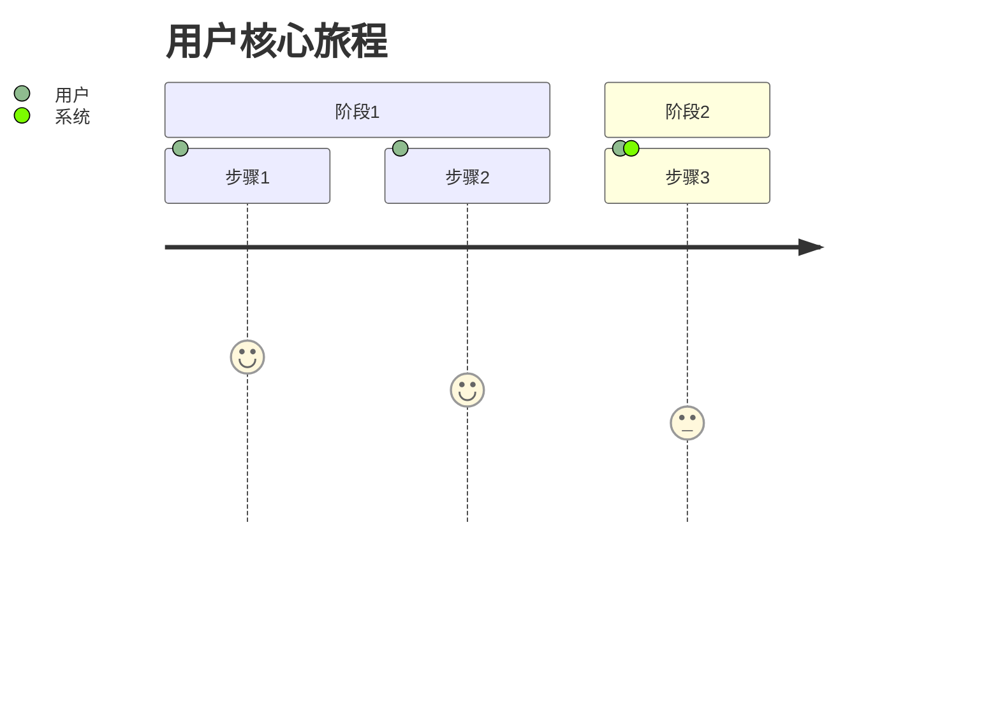
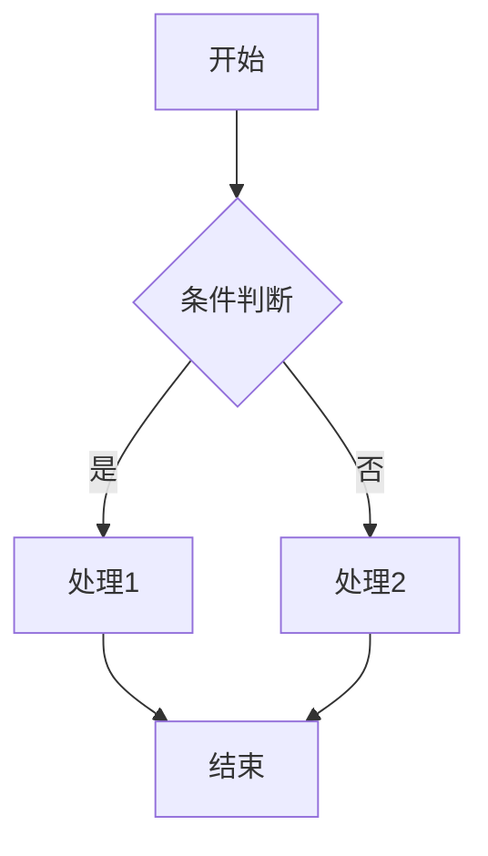
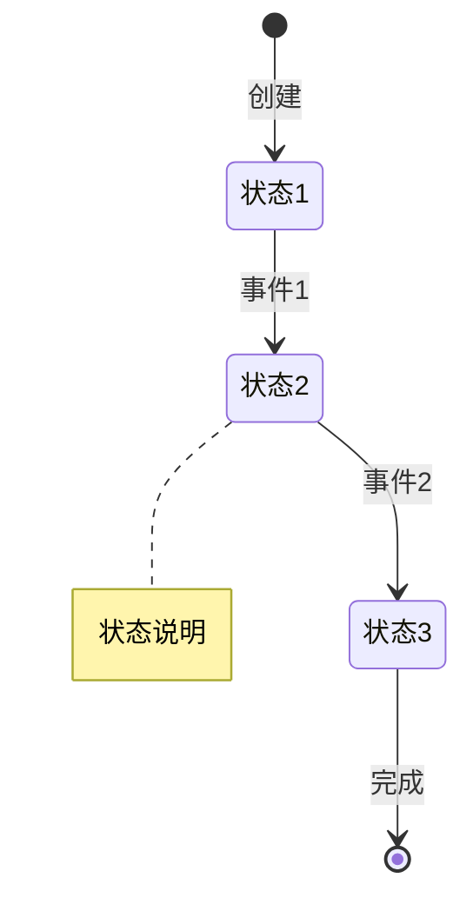
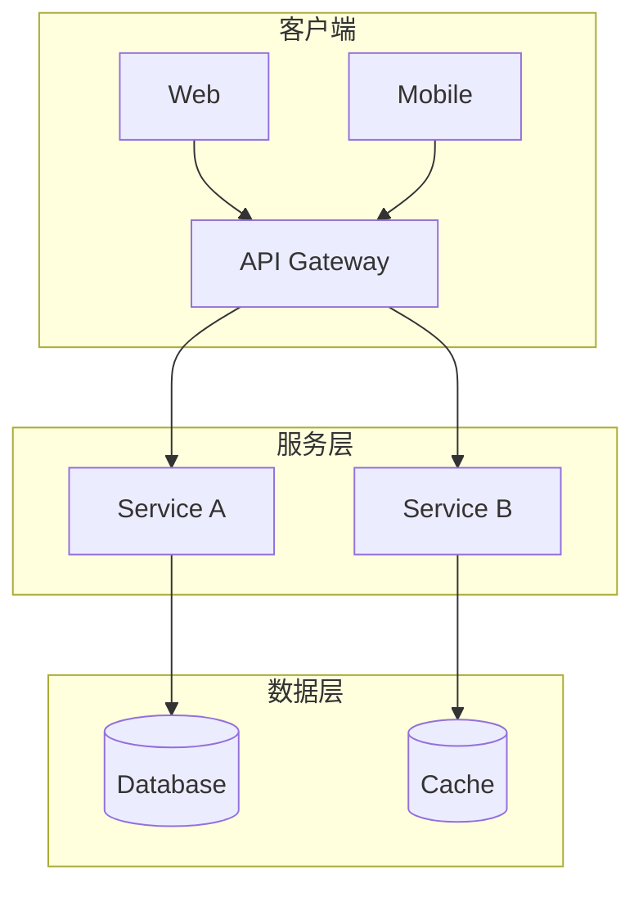
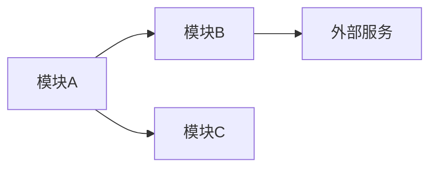
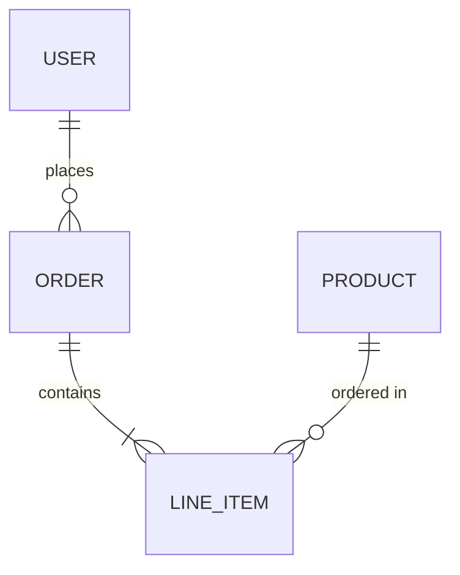
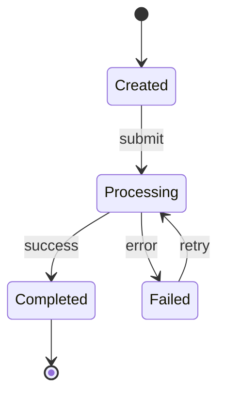
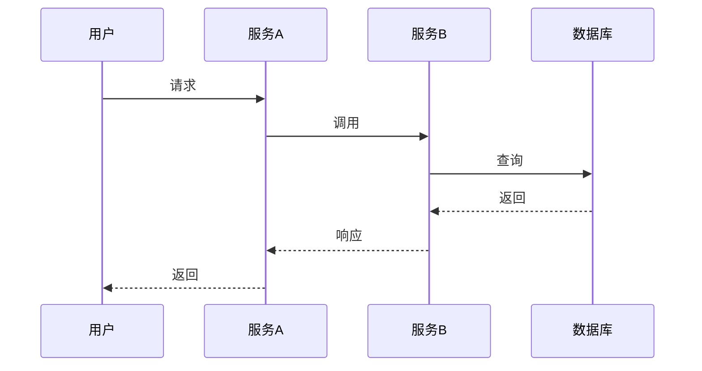
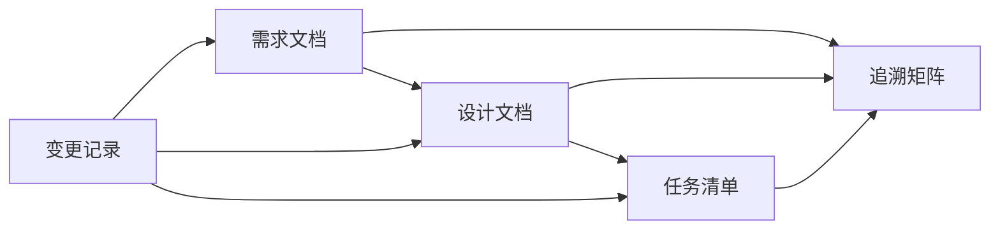

# 需求与设计文档模板

> 目标：把"做什么、边界是什么、怎么验收"讲清，降低返工风险

---

## 一、需求文档模板

### 1. 概述 (Overview)

```markdown
## 概述

### 项目背景
[简述项目背景、业务价值、解决的核心问题]

### 核心理念
[一句话描述产品核心价值主张]

### 相关方与负责人
| 角色/团队 | 负责人 | 职责 | 评审职责 | 备注 |
|-----------|--------|------|----------|------|
| 业务方 | [姓名] | [职责] | 需求评审 | |
| 研发 | [姓名] | [职责] | 技术可行性评审 | |
| 测试 | [姓名] | [职责] | 验收口径确认 | |
| 设计 | [姓名] | [职责] | 体验评审 | |
```

### 2. 目标与非目标 (Goals & Non-Goals)

```markdown
## 目标与非目标

### 目标 (Goals)
1. [目标1：具体、可衡量]
2. [目标2：具体、可衡量]
3. [目标3：具体、可衡量]

### 非目标 (Non-Goals) ⚠️ 必填
> 明确写出"不做什么"，防止范围蔓延

1. [非目标1：明确排除的功能/场景]
2. [非目标2：明确排除的功能/场景]
3. [非目标3：明确排除的功能/场景]

### 范围与阶段 (Scope & Milestones)
| 范围 | 说明 |
|------|------|
| In-Scope | [本期必须交付的能力范围] |
| Out-of-Scope | [明确不做/延后的能力范围] |

#### 阶段里程碑
| 里程碑 | 目标 | 预计日期 | 交付物 |
|--------|------|----------|--------|
| M1 | [目标] | [日期] | [交付物] |
| M2 | [目标] | [日期] | [交付物] |

### 成功指标 (Success Metrics)
| 指标 | 目标值 | 衡量方式 |
|------|--------|----------|
| [指标1] | [目标值] | [如何衡量] |
| [指标2] | [目标值] | [如何衡量] |
```

### 3. 用户与场景 (Users & Scenarios)

```markdown
## 用户与场景

### 目标用户
| 用户角色 | 描述 | 核心诉求 | 优先级 |
|----------|------|----------|--------|
| [角色1] | [描述] | [核心诉求] | P0 |
| [角色2] | [描述] | [核心诉求] | P1 |

### 核心使用场景
| 场景ID | 场景名称 | 用户角色 | 触发条件 | 预期结果 |
|--------|----------|----------|----------|----------|
| S-001 | [场景名] | [角色] | [触发条件] | [预期结果] |

### 用户旅程 (关键路径)


### 关键页面与原型
| 页面/流程 | 原型链接 | 说明 |
|-----------|----------|------|
| [页面/流程] | [链接] | [说明] |
```

### 3.1 前端设计输入 (Frontend Design Inputs) ⚠️ UI 项目必填

```markdown
## 前端设计输入

### 视觉与品牌参照
| 项 | 内容 | 说明 |
|----|------|------|
| 产品类型 | [SaaS/CRM/电商/工具/内容/游戏等] | 决定信息密度与视觉调性 |
| 目标气质 | [专业/高级/活泼/极简/工业/编辑感等] | 交给 `design-taste-frontend` 校准 |
| 品牌参照 | [Apple/Stripe/Notion/Linear/Claude/无] | 有品牌参照时使用 `brand-design-md` 获取 DESIGN.md |
| 反参照 | [明确不要像什么] | 避免默认 AI UI 或竞品误导 |

### Skill 路由
| 场景 | 必用 Skill | 输出 |
|------|------------|------|
| 需要完整 UI 设计 | `impeccable` + `design-taste-frontend` | 设计方向、布局原则、token 候选 |
| 需要大厂风格 | `brand-design-md` | 项目根或临时上下文中的 DESIGN.md |
| 需要 UI 工程规范 | `baseline-ui` | 组件、状态、响应式、Tailwind 约束 |
| 需要图标 | `better-icons` | 可追溯 SVG/icon id |
| 需要动效 | `motion-ai-kit`（如已安装）或 `fixing-motion-performance` | 动效方案与性能约束 |
| 需要无障碍 | `fixing-accessibility` | 键盘、焦点、ARIA、语义要求 |
| 需要页面元信息 | `fixing-metadata` | title/meta/OG/favicon 要求 |
```

### 4. 术语表 (Glossary)

```markdown
## 术语表

| 术语 | 定义 | 备注 |
|------|------|------|
| **Term_Name** | [定义] | [备注] |
```

### 5. 业务流程 (Business Flows)

```markdown
## 业务流程

### 主流程


### 异常流程与负面用例 ⚠️ 必填
> 至少覆盖 3 种异常场景

| 场景ID | 异常场景 | 触发条件 | 预期行为 | 兜底策略 |
|--------|----------|----------|----------|----------|
| E-001 | [异常场景1] | [触发条件] | [预期行为] | [兜底策略] |
| E-002 | [异常场景2] | [触发条件] | [预期行为] | [兜底策略] |
| E-003 | [异常场景3] | [触发条件] | [预期行为] | [兜底策略] |
```

### 6. 功能清单 (Feature List)

```markdown
## 功能清单

### 模块划分
| 模块 | 功能点 | 优先级 | 依赖 | 备注 |
|------|--------|--------|------|------|
| [模块1] | [功能1.1] | P0 | - | |
| [模块1] | [功能1.2] | P1 | 功能1.1 | |
| [模块2] | [功能2.1] | P0 | - | |

### 优先级定义
- **P0**: 核心功能，必须实现，阻塞上线
- **P1**: 重要功能，应该实现，影响体验
- **P2**: 增强功能，可以延后，锦上添花
```

### 7. 需求详情 (Requirements)

```markdown
## 需求详情

### Requirement [N]: [需求名称]

**User Story:** As a [角色], I want [功能], so that [价值]

#### 验收标准 (Acceptance Criteria)
> 使用 EARS 模式编写，确保可测试

1. WHEN [事件], THE [系统] SHALL [响应]
2. WHILE [状态], THE [系统] SHALL [响应]
3. IF [异常条件], THEN THE [系统] SHALL [响应]
4. WHERE [可选特性], THE [系统] SHALL [响应]

#### 业务规则
| 规则ID | 规则描述 | 校验逻辑 | 错误提示 |
|--------|----------|----------|----------|
| BR-001 | [规则描述] | [校验逻辑] | [错误提示] |
```

### 8. 业务规则 (Business Rules)

```markdown
## 业务规则

### 字段校验规则
| 字段 | 类型 | 必填 | 校验规则 | 错误提示 |
|------|------|------|----------|----------|
| [字段名] | [类型] | 是/否 | [规则] | [提示] |

### 状态流转 ⚠️ 必填


### 权限矩阵 ⚠️ 必填
| 操作 | 角色1 | 角色2 | 角色3 | 备注 |
|------|-------|-------|-------|------|
| [操作1] | ✅ | ❌ | 只读 | |
| [操作2] | ✅ | ✅ | ❌ | |
```

### 9. 数据字典 (Data Dictionary)

```markdown
## 数据字典

### 核心字段
| 字段名 | 中文名 | 类型 | 来源 | 取值范围 | 展示格式 | 存储格式 |
|--------|--------|------|------|----------|----------|----------|
| [字段] | [中文] | [类型] | [来源] | [范围] | [展示] | [存储] |

### 枚举值定义
| 枚举名 | 值 | 含义 | 备注 |
|--------|-----|------|------|
| [枚举名] | [值] | [含义] | |
```

### 10. 约束与依赖 (Constraints & Dependencies)

```markdown
## 约束与依赖

### 外部系统依赖
| 系统 | 用途 | SLA | 降级策略 | 负责人 |
|------|------|-----|----------|--------|
| [系统名] | [用途] | [SLA] | [降级策略] | [负责人] |

### 数据生命周期与隐私
| 数据类型 | 收集/来源 | 存储期限 | 加密/脱敏 | 删除/导出 |
|----------|-----------|----------|-----------|-----------|
| [类型] | [来源] | [期限] | [方式] | [策略] |

### 资源限制
| 资源 | 限制 | 影响 | 缓解措施 |
|------|------|------|----------|
| [资源] | [限制] | [影响] | [措施] |

### 法律合规
| 合规要求 | 描述 | 影响范围 | 实现方式 |
|----------|------|----------|----------|
| [要求] | [描述] | [范围] | [方式] |
```

### 11. 非功能需求 (Non-Functional Requirements)

```markdown
## 非功能需求

### 性能要求 ⚠️ 必须量化
| 指标 | 目标值 | 测量方式 | 优先级 |
|------|--------|----------|--------|
| 页面加载时间 | ≤2s | Lighthouse | P0 |
| API 响应时间 | ≤200ms (P95) | APM | P0 |
| 并发用户数 | ≥1000 | 压测 | P1 |
| 数据处理吞吐 | ≥100 TPS | 监控 | P1 |

### 稳定性要求
| 指标 | 目标值 | 测量方式 |
|------|--------|----------|
| 服务可用性 | ≥99.9% | 监控 |
| 错误率 | ≤0.1% | 日志 |
| 故障恢复时间 | ≤5min | 演练 |

### 安全要求
| 要求 | 描述 | 实现方式 |
|------|------|----------|
| 数据加密 | [描述] | [方式] |
| 认证授权 | [描述] | [方式] |
| 审计日志 | [描述] | [方式] |

### 兼容性要求
| 平台/浏览器 | 最低版本 | 优先级 |
|-------------|----------|--------|
| [平台] | [版本] | [优先级] |

### 可用性要求
| 要求 | 描述 | 验收标准 |
|------|------|----------|
| 无障碍 | [描述] | [标准] |
| 国际化 | [描述] | [标准] |
```

### 12. 验收标准 (Acceptance Criteria Summary)

```markdown
## 验收标准汇总

### P0 必须验收项
| ID | 验收项 | 验收条件 | 测试用例 |
|----|--------|----------|----------|
| AC-001 | [验收项] | [条件] | TC-XXX |

### P1 应该验收项
| ID | 验收项 | 验收条件 | 测试用例 |
|----|--------|----------|----------|
| AC-101 | [验收项] | [条件] | TC-XXX |

### P2 可选验收项
| ID | 验收项 | 验收条件 | 测试用例 |
|----|--------|----------|----------|
| AC-201 | [验收项] | [条件] | TC-XXX |
```

### 13. 风险与假设 (Risks & Assumptions)

```markdown
## 风险与假设

### 已知风险 ⚠️ 至少3项
| 风险ID | 风险描述 | 影响程度 | 发生概率 | 缓解措施 | 负责人 |
|--------|----------|----------|----------|----------|--------|
| R-001 | [风险描述] | 高/中/低 | 高/中/低 | [措施] | [负责人] |
| R-002 | [风险描述] | 高/中/低 | 高/中/低 | [措施] | [负责人] |
| R-003 | [风险描述] | 高/中/低 | 高/中/低 | [措施] | [负责人] |

### 关键假设
| 假设ID | 假设内容 | 验证方式 | 失效影响 |
|--------|----------|----------|----------|
| A-001 | [假设内容] | [验证方式] | [影响] |

### 待确认点 (Open Questions)
| 问题ID | 问题描述 | 相关方 | 截止日期 | 状态 |
|--------|----------|--------|----------|------|
| Q-001 | [问题描述] | [相关方] | [日期] | 待确认/已确认 |
```

### 14. 变更记录 (Change Log)

```markdown
## 变更记录

| 版本 | 日期 | 变更内容 | 影响范围 | 影响分析 | 变更人 | 评审人 |
|------|------|----------|----------|----------|--------|--------|
| v1.1 | [日期] | [变更内容] | [影响范围] | [影响分析] | [变更人] | [评审人] |
```

---

## 二、设计文档模板

### 1. 概述 (Overview)

```markdown
## 概述

### 设计目标
1. [目标1]
2. [目标2]

### 前端设计上下文
| 项 | 内容 |
|----|------|
| 触发的设计 Skill | `impeccable` / `design-taste-frontend` / `brand-design-md` / `baseline-ui` / `better-icons` / `fixing-accessibility` / `fixing-motion-performance` / `fixing-metadata` |
| DESIGN.md 来源 | [项目已有 / brand-design-md 拉取 / 无] |
| 设计方差 | [1-10] |
| 动效强度 | [1-10] |
| 信息密度 | [1-10] |
| 图标来源 | [better-icons icon id / 项目现有图标库] |

### 技术栈选择
| 层级 | 技术 | 版本 | 选型理由 |
|------|------|------|----------|
| [层级] | [技术] | [版本] | [理由] |
```

### 2. 架构与模块 (Architecture)

```markdown
## 架构与模块

### 系统架构图


### 模块划分
| 模块 | 职责 | 依赖 | 接口 |
|------|------|------|------|
| [模块名] | [职责] | [依赖] | [接口] |

### 依赖关系图

```

### 3. 数据模型 (Data Model)

```markdown
## 数据模型

### ER 图


### 核心实体
```typescript
interface Entity {
  id: string;
  // 字段定义
  createdAt: Date;
  updatedAt: Date;
}
```

### 索引设计 ⚠️ 必填
| 表名 | 索引名 | 字段 | 类型 | 用途 |
|------|--------|------|------|------|
| [表名] | [索引名] | [字段] | 唯一/普通/复合 | [用途] |

### 数据迁移策略
| 迁移项 | 策略 | 回滚方案 | 预计耗时 |
|--------|------|----------|----------|
| [迁移项] | [策略] | [回滚] | [耗时] |
```

### 4. 接口定义 (API Design)

```markdown
## 接口定义

### API 列表
| 方法 | 路径 | 描述 | 权限 |
|------|------|------|------|
| POST | /api/v1/resource | 创建资源 | user |

### 接口详情

#### POST /api/v1/resource

**请求**
```json
{
  "field1": "string",
  "field2": 123
}
```

**响应**
```json
{
  "code": 0,
  "data": {},
  "message": "success"
}
```

**错误码** ⚠️ 必填
| 错误码 | 含义 | 处理建议 |
|--------|------|----------|
| 400001 | 参数错误 | 检查请求参数 |
| 401001 | 未授权 | 重新登录 |
| 500001 | 服务器错误 | 联系管理员 |

**幂等性** ⚠️ 必填
- 幂等键: `X-Idempotency-Key` header
- 有效期: 24小时
- 重复请求返回原结果
```

### 5. 状态与流程 (State & Flow)

```markdown
## 状态与流程

### 状态机


### 时序图

```

### 6. 关键方案与权衡 (Key Decisions)

```markdown
## 关键方案与权衡

### 决策记录
| 决策ID | 决策点 | 选择方案 | 备选方案 | 选择理由 | 权衡点 |
|--------|--------|----------|----------|----------|--------|
| D-001 | [决策点] | [选择] | [备选] | [理由] | [权衡] |

### 详细分析

#### D-001: [决策点]

**背景**: [描述背景]

**方案对比**:
| 维度 | 方案A | 方案B | 方案C |
|------|-------|-------|-------|
| 复杂度 | 低 | 中 | 高 |
| 性能 | 高 | 中 | 低 |
| 成本 | 低 | 中 | 高 |

**选择**: 方案A

**理由**: [详细理由]

**风险**: [潜在风险]
```

### 7. 异常与边界 (Error Handling)

```markdown
## 异常与边界

### 异常处理策略 ⚠️ 必填
| 异常类型 | 处理方式 | 重试策略 | 兜底方案 | 告警级别 |
|----------|----------|----------|----------|----------|
| 网络超时 | 重试 | 3次/指数退避 | 返回缓存 | Warning |
| 服务不可用 | 熔断 | - | 降级响应 | Critical |
| 数据异常 | 记录日志 | - | 人工处理 | Error |

### 超时配置
| 调用链路 | 超时时间 | 理由 |
|----------|----------|------|
| [链路] | [时间] | [理由] |

### 限流配置
| 接口 | 限流策略 | 阈值 | 超限处理 |
|------|----------|------|----------|
| [接口] | [策略] | [阈值] | [处理] |
```

### 8. 监控与日志 (Observability)

```markdown
## 监控与日志

### 监控指标
| 指标名 | 类型 | 描述 | 告警阈值 |
|--------|------|------|----------|
| [指标] | Counter/Gauge/Histogram | [描述] | [阈值] |

### 告警规则
| 告警名 | 条件 | 级别 | 通知方式 |
|--------|------|------|----------|
| [告警] | [条件] | P0/P1/P2 | [方式] |

### 日志规范
| 日志类型 | 级别 | 格式 | 保留期 |
|----------|------|------|--------|
| 访问日志 | INFO | JSON | 30天 |
| 错误日志 | ERROR | JSON | 90天 |
| 审计日志 | INFO | JSON | 1年 |

### 埋点设计
| 埋点ID | 事件名 | 触发时机 | 参数 |
|--------|--------|----------|------|
| [ID] | [事件] | [时机] | [参数] |
```

### 9. 测试策略 (Testing Strategy)

```markdown
## 测试策略

### 测试分层
| 层级 | 覆盖范围 | 工具 | 覆盖率目标 |
|------|----------|------|------------|
| 单元测试 | 函数/类 | Jest/Vitest | ≥80% |
| 集成测试 | 模块间 | Supertest | ≥60% |
| E2E测试 | 主流程 | Playwright | 核心路径100% |

### Mock 依赖清单 ⚠️ 必填
| 依赖 | Mock 方式 | Mock 数据来源 |
|------|-----------|---------------|
| [依赖] | [方式] | [来源] |

### 联调依赖
| 依赖方 | 接口 | 联调环境 | 负责人 |
|--------|------|----------|--------|
| [依赖方] | [接口] | [环境] | [负责人] |
```

### 10. 发布与运维 (Release & Ops)

```markdown
## 发布与运维

### 发布策略
| 环节 | 策略 | 负责人 | 风险与缓解 |
|------|------|--------|------------|
| 灰度/分批 | [策略] | [负责人] | [风险] |
| 全量发布 | [策略] | [负责人] | [风险] |

### 回滚与降级
| 场景 | 回滚/降级策略 | 触发条件 | 负责人 |
|------|----------------|----------|--------|
| [场景] | [策略] | [条件] | [负责人] |

### 特性开关与配置
| 配置项 | 作用 | 默认值 | 动态调整 | 备注 |
|--------|------|--------|----------|------|
| [配置] | [作用] | [默认] | 是/否 | [备注] |
```

---

## 三、追溯矩阵

```markdown
## 追溯矩阵

| 需求ID | 设计章节 | 接口 | 数据表 | 测试用例 | 状态 |
|--------|----------|------|--------|----------|------|
| Req-001 | 2.1 | POST /api/xxx | table_a | TC-001 | 已实现 |
| Req-002 | 2.2 | GET /api/xxx | table_b | TC-002 | 开发中 |
```

---

## 四、评审检查清单

### 需求文档评审检查
- [ ] "非目标"至少列出 3 项明确不做的功能
- [ ] 每个用户角色都有对应的使用场景
- [ ] 主流程有流程图，异常流程至少覆盖 3 种
- [ ] 所有功能点都标注了优先级 (P0/P1/P2)
- [ ] 状态流转有状态机图
- [ ] 权限矩阵已定义
- [ ] 数据字典包含枚举值和边界值
- [ ] 非功能需求有量化指标（不是"高性能"等空话）
- [ ] 验收标准可直接转为测试用例
- [ ] 风险清单至少 3 项，每项有缓解措施
- [ ] 待确认点已列出并指定负责人

### 设计文档评审检查
- [ ] 架构图包含所有外部依赖
- [ ] 数据模型包含索引设计
- [ ] 接口定义包含错误码和幂等性说明
- [ ] 关键决策记录了"为什么不用其他方案"
- [ ] 异常处理包含重试、超时、兜底策略
- [ ] 监控指标和告警规则已定义
- [ ] 测试策略包含 Mock 依赖清单
- [ ] 追溯矩阵已建立（需求→设计→测试）
- [ ] UI 项目已记录触发的前端设计 skill 和 DESIGN.md 来源
- [ ] 图标、动效、无障碍、元数据已分别映射到 `better-icons`、`motion-ai-kit`/`fixing-motion-performance`、`fixing-accessibility`、`fixing-metadata`

---

## 五、降低返工的关键动作

### 需求阶段
1. **评审前补齐** "非目标/边界/验收标准"
2. **提前写** "异常流程与负面用例"
3. **与设计同步** "关键字段/状态流转/权限矩阵"

### 设计阶段
1. **先画图后写字** - 架构图、时序图、状态机先行
2. **决策留痕** - 记录"为什么这么做"和"为什么不用其他方案"
3. **异常先行** - 先设计异常处理，再实现正常流程

### 变更管理
1. **变更记录** - 每次变更必须记录影响分析
2. **追溯更新** - 变更后同步更新追溯矩阵
3. **评审确认** - 重大变更需重新评审

---

## 六、模板使用说明

### 必填项标记
- ⚠️ 标记的章节为**必填项**，评审前必须完成
- 未标记的章节根据项目复杂度选填

### 优先级定义
- **P0**: 核心功能，阻塞上线
- **P1**: 重要功能，影响体验
- **P2**: 增强功能，可延后

### 文档维护
- 需求变更时同步更新需求文档
- 设计变更时同步更新设计文档
- 每次变更记录在变更日志中


---

## 七、快速参考卡片

### EARS 模式速查

| 模式 | 格式 | 适用场景 |
|------|------|----------|
| **Ubiquitous** | THE [系统] SHALL [响应] | 始终生效的需求 |
| **Event-driven** | WHEN [事件], THE [系统] SHALL [响应] | 事件触发的需求 |
| **State-driven** | WHILE [状态], THE [系统] SHALL [响应] | 状态期间的需求 |
| **Unwanted** | IF [异常], THEN THE [系统] SHALL [响应] | 异常处理需求 |
| **Optional** | WHERE [条件], THE [系统] SHALL [响应] | 可选功能需求 |
| **Complex** | [WHERE] [WHILE] [WHEN/IF] THE [系统] SHALL [响应] | 复合条件需求 |

### 常见返工原因 Top 10

| 排名 | 原因 | 预防措施 |
|------|------|----------|
| 1 | 需求边界不清 | 写明"非目标" |
| 2 | 异常流程遗漏 | 强制写负面用例 |
| 3 | 状态流转不明 | 画状态机图 |
| 4 | 权限规则模糊 | 填权限矩阵 |
| 5 | 接口定义不全 | 补错误码和幂等性 |
| 6 | 性能要求空泛 | 量化指标 |
| 7 | 外部依赖未考虑 | 列降级策略 |
| 8 | 数据格式不一致 | 写数据字典 |
| 9 | 验收标准不可测 | 用 EARS 模式 |
| 10 | 变更无影响分析 | 记变更日志 |

### 评审问题清单

**需求评审必问**:
1. "这个功能不做会怎样？" → 验证必要性
2. "用户会怎么误用？" → 发现负面用例
3. "如果 XXX 失败了怎么办？" → 暴露异常流程
4. "这个需求怎么测？" → 验证可测试性
5. "上线后怎么知道成功了？" → 确认成功指标

**设计评审必问**:
1. "为什么不用 XXX 方案？" → 验证决策合理性
2. "这个接口超时了怎么办？" → 检查异常处理
3. "数据量大了会怎样？" → 验证扩展性
4. "怎么回滚？" → 确认回滚方案
5. "怎么监控？" → 检查可观测性

---

## 八、模板文件结构

```
.kiro/specs/{feature-name}/
├── requirements.md    # 需求文档
├── design.md          # 设计文档
├── tasks.md           # 实现任务
└── changelog.md       # 变更记录（可选）
```

### 文档关系



---

*模板版本: v1.1*
*最后更新: 2026-01-12*

