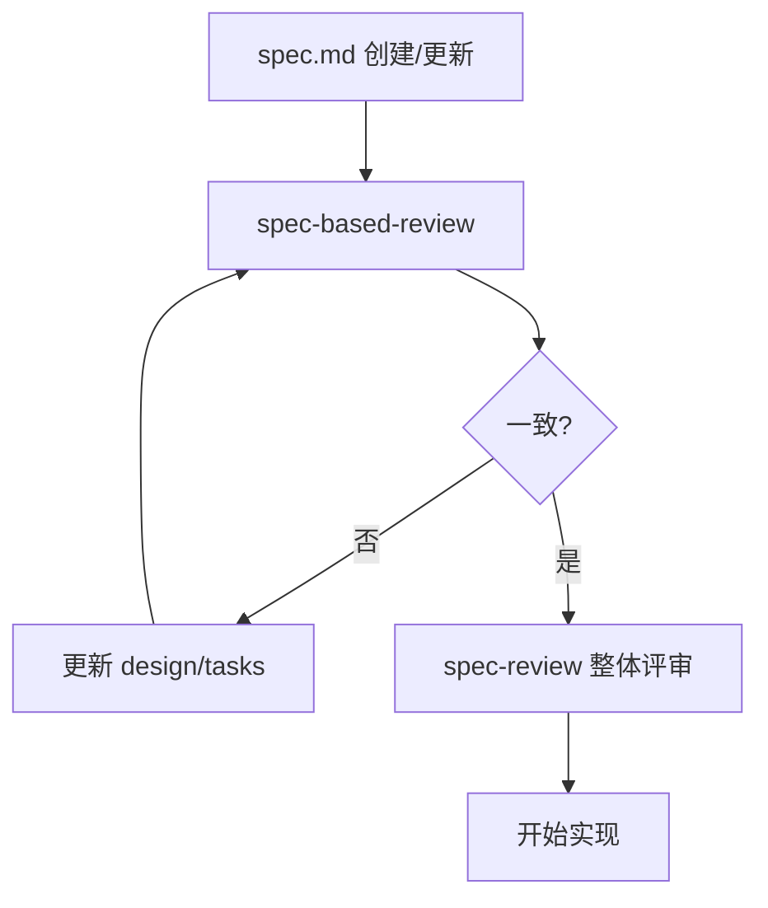

# Spec-Based Review（基于规格的反向评审）

> 目标：以 spec.md 为 **唯一真相来源**，验证 design.md 与 tasks.md 是否完整覆盖、表述一致、符合最佳实践

---

## 工作流程


---

## 适用场景

- spec.md 已完成或更新后，需验证 design/tasks 是否同步
- 发现 design/tasks 与实际实现不一致时，回溯到 spec 重新对齐
- 确保文档体系遵循最佳实践

---

## 评审步骤

### 步骤 1：读取 spec.md

**提取清单**：

| 类型 | 提取项 |
|------|--------|
| 术语定义 | 所有 `> **术语**` 定义块 |
| Requirements | 所有 `### Requirement:` 章节 |
| Scenarios | 每个 Requirement 下的 `#### Scenario:` |
| 附录 | 配置示例、关键词集合等 |

### 步骤 2：对齐 design.md

| 检查项 | 验证方法 | 预期结果 |
|--------|----------|----------|
| **Decisions 覆盖** | 每个 spec Requirement 是否有对应 Decision | 1:1 或 N:1 映射 |
| **术语一致** | design 中使用的术语是否与 spec 定义一致 | 无偏差 |
| **Goals 对齐** | design Goals 是否覆盖 spec 中的核心 Requirements | 无遗漏 |
| **Non-Goals 合理** | Non-Goals 是否与 spec 范围冲突 | 无冲突 |
| **Compatibility 完整** | 每个 spec 中涉及现有组件的 Requirement 是否有兼容性说明 | 有对应条目 |
| **Open Questions 状态** | 所有问题是否已关闭或有明确待办 | 无悬而未决 |

### 步骤 3：对齐 tasks.md

| 检查项 | 验证方法 | 预期结果 |
|--------|----------|----------|
| **任务覆盖** | 每个 spec Requirement 是否有对应任务 | 1:N 映射 |
| **追溯标注** | 任务是否有 `_Requirements: X.Y_` 标注 | 全部有标注 |
| **场景对应** | spec Scenarios 是否有对应测试任务 | 有 Validation 任务 |
| **依赖顺序** | 任务顺序是否符合 spec 中定义的逻辑依赖 | 无循环、顺序合理 |
| **验证任务** | 每个可测试 Scenario 是否有测试任务 | 有 `_Validates:_` 标注 |

### 步骤 4：最佳实践检查

#### design.md 最佳实践

- [ ] 有 Context 章节说明背景
- [ ] Goals/Non-Goals 明确边界
- [ ] Decisions 使用主动语态
- [ ] Compatibility 覆盖五维度（入口/配置/行为/日志/依赖）
- [ ] Risks/Trade-offs 有缓解措施
- [ ] Migration Plan 分步骤渐进

#### tasks.md 最佳实践

- [ ] Implementation 与 Validation 分组
- [ ] 任务编号连续（1, 1.1, 1.2, 2...）
- [ ] 每个任务有 `_Requirements:_` 追溯
- [ ] 验证任务有 `_Validates:_` 标注
- [ ] 高风险任务有 Checkpoint（确保测试通过）
- [ ] 可选任务标记 `*`

---

## 评审报告模板

```markdown
# Spec-Based Review: [change-name]

## 1. 快速摘要

| 维度 | 状态 | 问题数 |
|------|------|--------|
| design.md 覆盖度 | ✅/⚠️/❌ | N/M Requirements |
| tasks.md 覆盖度 | ✅/⚠️/❌ | N/M Requirements |
| 术语一致性 | ✅/⚠️/❌ | N |
| 最佳实践 design | ✅/⚠️/❌ | N/M 项 |
| 最佳实践 tasks | ✅/⚠️/❌ | N/M 项 |

## 2. 覆盖度矩阵

| spec Requirement | design Decision | tasks 任务 | 状态 |
|------------------|-----------------|------------|------|
| [Requirement 1] | [Decision X] | 1.1, 1.2 | ✅ |
| [Requirement 2] | ❌ 缺失 | 1.3 | ⚠️ |

## 3. 术语偏差

| 术语 | spec 定义 | design/tasks 用法 | 建议 |
|------|-----------|-------------------|------|
| [术语 A] | [定义] | [实际用法] | [修正建议] |

## 4. 最佳实践差距

### design.md
- ⚠️ [缺失项]

### tasks.md
- ⚠️ [缺失项]

## 5. 改进建议

- [ ] 建议 1
- [ ] 建议 2

## 6. 下一步

- 若无问题：文档体系一致，可进入 EXECUTION
- 若有问题：按建议更新后重新 review
```

---

## 严重级别定义

| 级别 | 标记 | 定义 | 处理要求 |
|------|------|------|----------|
| Critical | 🔴 | spec 有 Requirement 但 design/tasks 无覆盖 | 必须补齐 |
| Warning | 🟡 | 术语不一致或追溯标注缺失 | 建议修复 |
| Info | 🟢 | 最佳实践建议 | 可选优化 |

---

## 快速检查清单

### spec.md → design.md

- [ ] 每个 Requirement 有 Decision 覆盖
- [ ] 术语定义被正确引用
- [ ] Goals 覆盖核心 Requirements
- [ ] Compatibility 覆盖涉及现有组件的 Requirements

### spec.md → tasks.md

- [ ] 每个 Requirement 有实现任务
- [ ] 每个可测试 Scenario 有验证任务
- [ ] 任务有 `_Requirements:_` 追溯标注
- [ ] 验证任务有 `_Validates:_` 标注

---

## 与其他工作流的关系



- **前置**：spec.md 已完成或更新
- **后续**：通过后可直接实现或再做 `/spec-review` 整体评审
