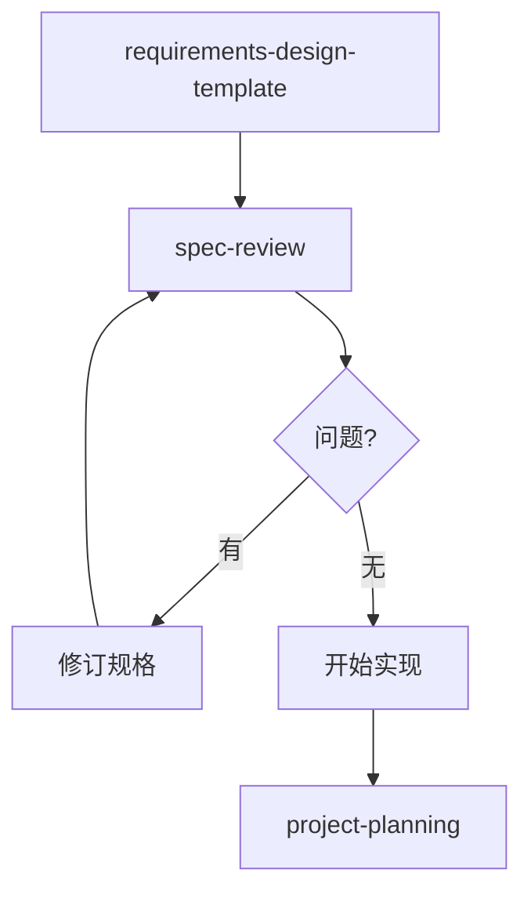

# Spec Review（规格评审）

> 目标：对需求/设计/任务进行一致性审查，并与现有代码、测试入口和约束对齐

---

## 工作流程


---

## 输入范围

- 规格路径：`.kiro/specs/<spec-name>/`
- 必读文件：
  - `requirements.md` - 需求文档
  - `design.md` - 设计文档
  - `tasks.md` - 任务清单

---

## 评审步骤

### 步骤 1：读取规格文档

**提取内容清单**：

| 文档 | 提取项 |
|------|--------|
| requirements.md | 用户故事、验收标准（EARS 格式）、术语表、非功能需求 |
| design.md | 架构图、组件接口、数据模型、正确性属性、错误处理、测试策略 |
| tasks.md | 任务层级、依赖关系、属性测试标注、可选任务标记 |

### 步骤 2：构建追溯矩阵

建立 Requirements → Design → Tasks 的映射关系：

```markdown
| 需求ID | 验收标准 | 设计章节 | 正确性属性 | 任务编号 | 状态 |
|--------|----------|----------|------------|----------|------|
| 1.1 | WHEN... | 组件A | Property 1 | 1.1, 1.2 | ✅ |
| 1.2 | WHILE... | 组件A | Property 2 | 1.3 | ⚠️ 缺失 |
```

**检查项**：
- [ ] 每个验收标准都有对应的设计章节
- [ ] 可测试的验收标准都有对应的正确性属性
- [ ] 每个正确性属性都有对应的任务
- [ ] 任务的 `_Requirements: X.Y_` 标注与需求对应

### 步骤 3：EARS 格式合规检查

验证验收标准是否符合 EARS 模式：

| 模式 | 格式 | 检查点 |
|------|------|--------|
| Ubiquitous | THE [系统] SHALL [响应] | 无条件触发 |
| Event-driven | WHEN [事件], THE [系统] SHALL [响应] | 有明确触发事件 |
| State-driven | WHILE [状态], THE [系统] SHALL [响应] | 有持续状态 |
| Unwanted | IF [异常], THEN THE [系统] SHALL [响应] | 异常处理 |
| Optional | WHERE [条件], THE [系统] SHALL [响应] | 可选功能 |

**常见问题**：
- ❌ 使用模糊词汇（"快速"、"合理"、"适当"）
- ❌ 使用代词（"它"、"这个"）
- ❌ 缺少可测试的量化指标
- ❌ 负面陈述（应改为正面陈述）

### 步骤 4：正确性属性检查

验证 design.md 中的 Correctness Properties：

**必须包含**：
- [ ] 属性编号（Property 1, 2, ...）
- [ ] 全称量化语句（"For any..."）
- [ ] 需求追溯（"Validates: Requirements X.Y"）

**属性类型覆盖检查**：

| 类型 | 适用场景 | 示例 |
|------|----------|------|
| Round-trip | 序列化/解析 | `parse(format(x)) == x` |
| Invariant | 状态转换 | 操作后保持某属性不变 |
| Idempotence | 重复操作 | `f(f(x)) == f(x)` |
| Metamorphic | 关系验证 | `len(filter(x)) <= len(x)` |

### 步骤 5：代码与测试入口对齐

**搜索现有代码**：
```bash
# 搜索涉及的模块
rg -l "模块名" src/

# 搜索测试入口
rg -l "describe|test|it" tests/

# 搜索全局 setup
rg "globalSetup|setupFiles" vitest*.config.ts
```

**检查项**：
- [ ] 设计中的组件路径与现有代码结构一致
- [ ] 测试策略与现有测试框架配置兼容
- [ ] 环境变量与 `.env.example` 对齐
- [ ] 导出路径与 `src/index.ts` 一致

### 步骤 6：任务拆解审查

**任务结构检查**：
- [ ] 任务编号连续（1, 1.1, 1.2, 2, 2.1...）
- [ ] 子任务在父任务下方
- [ ] 可选任务标记 `*`（如 `[ ]* 1.2 编写属性测试`）
- [ ] 每个任务有 `_Requirements: X.Y_` 标注

**测试覆盖检查**：
- [ ] 属性测试任务引用了 design.md 中的 Property
- [ ] 属性测试使用 fast-check，最少 100 次迭代
- [ ] 有 Checkpoint 任务（确保测试通过）

**依赖顺序检查**：
- [ ] 核心实现在测试之前
- [ ] 集成任务在单元任务之后
- [ ] 无循环依赖

---

## 输出格式

### 评审报告模板

```markdown
# Spec Review Report: [spec-name]

## 评审概要

| 维度 | 状态 | 问题数 |
|------|------|--------|
| 追溯完整性 | ✅/⚠️/❌ | N |
| EARS 合规性 | ✅/⚠️/❌ | N |
| 属性覆盖 | ✅/⚠️/❌ | N |
| 代码对齐 | ✅/⚠️/❌ | N |
| 任务结构 | ✅/⚠️/❌ | N |

## 问题清单

| 严重级别 | 来源 | 问题描述 | 建议修复 |
|----------|------|----------|----------|
| 🔴 Critical | requirements.md#1.2 | 验收标准不可测试 | 添加量化指标 |
| 🟡 Warning | design.md#Property3 | 缺少需求追溯 | 添加 Validates |
| 🟢 Info | tasks.md#2.1 | 建议拆分子任务 | 可选优化 |

## 追溯矩阵

[完整的追溯矩阵表格]

## 风险清单

| 风险类型 | 描述 | 影响 | 缓解措施 |
|----------|------|------|----------|
| 实现风险 | [描述] | [影响] | [措施] |
| 测试风险 | [描述] | [影响] | [措施] |
| 兼容性风险 | [描述] | [影响] | [措施] |

## 最小修订建议

1. [必须修改项 1]
2. [必须修改项 2]
```

---

## 严重级别定义

| 级别 | 标记 | 定义 | 处理要求 |
|------|------|------|----------|
| Critical | 🔴 | 阻塞实现或导致错误 | 必须修复后才能开始实现 |
| Warning | 🟡 | 影响质量或可维护性 | 建议修复，可带风险实现 |
| Info | 🟢 | 优化建议 | 可选修复 |

---

## 快速检查清单

### requirements.md 检查

- [ ] 有 Introduction 和 Glossary
- [ ] 每个 Requirement 有 User Story
- [ ] 验收标准使用 EARS 格式
- [ ] 无模糊词汇和代词
- [ ] 术语表定义了所有系统名称

### design.md 检查

- [ ] 有架构图（Mermaid）
- [ ] 有组件接口定义（TypeScript）
- [ ] 有数据模型
- [ ] 有 Correctness Properties 章节
- [ ] 每个 Property 有全称量化和需求追溯
- [ ] 有 Error Handling 章节
- [ ] 有 Testing Strategy 章节

### tasks.md 检查

- [ ] 有 Overview
- [ ] 任务编号连续
- [ ] 有 `_Requirements: X.Y_` 标注
- [ ] 属性测试任务引用 Property
- [ ] 有 Checkpoint 任务
- [ ] 可选任务标记 `*`

---

## 注意事项

1. **只做评审与对齐**，不直接实现代码
2. **如规格缺少必需文档**，先补齐缺口再评审
3. **输出内容保持简洁**，聚焦可执行的修复建议
4. **优先处理 Critical 问题**，Warning 和 Info 可延后
5. **评审结果记录到 MCP/记忆系统**，便于后续追踪

---

## 与其他工作流的关系



- **前置**：使用 `requirements-design-template` 创建规格
- **后续**：评审通过后使用 `project-planning` 细化计划

---

## OpenSpec 变更评审（扩展）

> 适用于 `openspec/changes/<change-name>/` 结构的规格评审。

### OpenSpec 结构

```
openspec/changes/<change-name>/
├── proposal.md      # 变更背景与影响
├── design.md        # 设计决策与迁移计划
├── tasks.md         # 实现与验证任务
└── specs/
    └── <spec-name>/
        └── spec.md  # 规格详情 (Requirements + Scenarios)
```

### OpenSpec 评审步骤

#### 步骤 O1：结构检查
1. 验证必要文件存在：`proposal.md` / `design.md` / `tasks.md` / `specs/*/spec.md`
2. 检查 `design.md` 中 Open Questions 是否已解决

#### 步骤 O2：覆盖度分析
1. 提取 `design.md` 中的 Decisions 列表
2. 提取 `spec.md` 中的 Requirements 列表
3. 验证每个 Decision 有对应的 Requirement 覆盖

#### 步骤 O3：代码扫描
1. 从 spec.md 提取涉及的组件/接口名称（类名、函数名、配置文件名）
2. 使用 `grep_search` 在项目中搜索现有实现
3. 记录：存在性、实现位置、接口签名

#### 步骤 O4：兼容性分析

| 兼容维度 | 分析要点 | 评估输出 |
|----------|----------|----------|
| **入口兼容** | 现有 API 签名是否保持？调用方是否需改动？ | 风险等级 + 迁移成本 |
| **配置兼容** | 现有配置结构是否保持？新字段是否向后兼容？ | 配置迁移方案 |
| **行为兼容** | 默认模式下行为是否与当前一致？（无感知升级） | 回归测试范围 |
| **日志兼容** | 现有日志语义是否保留？新字段是否破坏解析？ | 日志消费方影响 |
| **依赖兼容** | 是否引入新依赖？是否影响现有版本？ | 依赖变更清单 |

#### 步骤 O5：设计质量评估

| 评估项 | 评估问题 | 评分标准 |
|--------|----------|----------|
| **问题解决度** | 设计是否真正解决 proposal 描述的问题？ | 根因解决 / 表象缓解 / 未解决 |
| **过度设计** | 是否引入超出当前需求的复杂度？ | 恰好 / 轻微 / 严重 |
| **可扩展性** | 未来类似需求是否可复用此设计？ | 可复用 / 需改造 / 不可复用 |
| **可测试性** | 每个 Requirement 是否可直接编写测试用例？ | 全部可测 / 部分抽象 / 难以验证 |
| **职责单一** | 变更是否聚焦单一关注点？ | 单一 / 轻微耦合 / 严重耦合 |

#### 步骤 O6：改进建议生成

| 问题类型 | 改进建议 |
|----------|----------|
| 术语模糊 | 补充术语定义章节 |
| 场景抽象 | 细化为具体 hook/参数/输入输出 |
| 缺少示例 | 补充配置/代码片段 |
| 兼容风险 | 补充 Compatibility 章节到 design.md |
| 覆盖遗漏 | 新增对应 Requirement |
| Open Questions 未关闭 | 提供结论建议 |

### OpenSpec 评审报告模板

```markdown
# Spec Review: <change-name>

## 1. 快速摘要

| 维度 | 状态 |
|------|------|
| 结构完整性 | ✅ / ⚠️ / ❌ |
| 覆盖度 | X / Y Decisions 已覆盖 |
| 兼容性风险 | 低 / 中 / 高 |
| 设计质量 | 良好 / 需改进 / 需重设计 |

## 2. 兼容性分析

| 兼容维度 | 风险 | 迁移成本 | 建议 |
|----------|------|----------|------|
| 入口兼容 | | | |
| 配置兼容 | | | |
| 行为兼容 | | | |
| 日志兼容 | | | |
| 依赖兼容 | | | |

## 3. 设计质量

| 评估项 | 评分 | 说明 |
|--------|------|------|
| 问题解决度 | | |
| 过度设计 | | |
| 可扩展性 | | |
| 可测试性 | | |
| 职责单一 | | |

## 4. 代码对齐

| spec 组件 | 现有实现 | 差距 | 实现难度 |
|-----------|----------|------|----------|

## 5. 改进建议

- [ ] 建议 1
- [ ] 建议 2

## 6. 下一步

- 若改进建议为空：可进入 EXECUTION
- 若有改进建议：先更新 spec，再重新 review
```

### OpenSpec 快速检查清单

#### 结构
- [ ] proposal.md 存在
- [ ] design.md 存在
- [ ] tasks.md 存在
- [ ] specs/*/spec.md 存在

#### 覆盖度
- [ ] 所有 Decisions 有对应 Requirement
- [ ] Open Questions 已关闭或有明确待办

#### 兼容性
- [ ] 入口 API 签名不变
- [ ] 配置向后兼容
- [ ] 默认行为无感知升级
- [ ] 日志语义保留
- [ ] 无新外部依赖（或已评估）

#### 设计质量
- [ ] 解决 proposal 描述的根本问题
- [ ] 无过度设计
- [ ] 可扩展复用
- [ ] 场景可直接测试
- [ ] 职责单一

#### 规格内容
- [ ] 抽象术语有定义
- [ ] 场景有具体输入/输出
- [ ] 提供配置示例
- [ ] 字段说明完整
