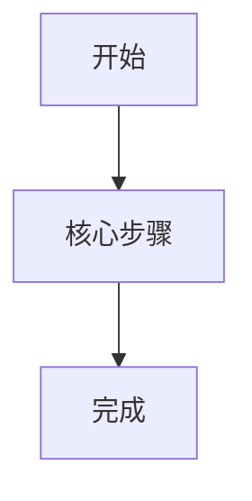

# PRD-Lite 模板

> 目标: 把原始需求收敛成 Codex 可以直接消费的产品真相源。未填完整前，不应进入设计或实现阶段。

## 1. 基本信息

- Feature ID:
- Feature 名称:
- 来源: issue / 会议纪要 / 事故复盘 / 业务需求 / 其他
- 负责人:
- 相关方:
- 当前状态: Draft / Review / Approved / Changed
- 最后更新:

## 2. 背景与问题

- 业务背景:
- 当前问题:
- 为什么现在做:
- 不做的影响:
- 现有替代方案:

## 3. 目标与非目标

### 目标

| 目标 ID | 目标描述 | 衡量方式 | 优先级 |
| --- | --- | --- | --- |
| G-001 | | | P0 |

### 非目标

| 非目标 ID | 本期明确不做 | 原因 | 后续处理 |
| --- | --- | --- | --- |
| NG-001 | | | |

## 4. 用户与角色

| 角色 | 使用场景 | 核心诉求 | 权限差异 | 优先级 |
| --- | --- | --- | --- | --- |
| | | | | P0 |

## 5. 范围边界

| 范围 | 内容 |
| --- | --- |
| In scope | |
| Out of scope | |
| 允许变更 | |
| 禁止变更 | |
| 依赖前置条件 | |

## 6. 业务流程

### 主流程

### 异常流程

| 场景 ID | 异常场景 | 触发条件 | 预期行为 | 兜底策略 |
| --- | --- | --- | --- | --- |
| E-001 | | | | |

## 7. 页面 / 流程 / 接口影响

| 类型 | 名称 | 影响说明 | 对应真相源 |
| --- | --- | --- | --- |
| 页面 | | | `page-inventory.md` |
| 状态 | | | `state-matrix.yaml` |
| 接口 | | | `contracts/openapi.yaml` |
| 权限 | | | 本文权限矩阵 |

## 8. 功能需求

| 需求 ID | 用户故事 / 能力 | 优先级 | 关联页面 | 关联状态 | 验收入口 |
| --- | --- | --- | --- | --- | --- |
| FR-001 | As a [角色], I want [能力], so that [价值] | P0 | | | `acceptance-criteria.md` |

## 9. 需求到界面追溯

| 需求 ID | 关联页面 / 视图 | 页面状态 | UI 元素 / 操作 | 依赖字段 | 依赖接口 | 验收标准 | 追溯状态 |
| --- | --- | --- | --- | --- | --- | --- | --- |
| FR-001 | page-001 | default / empty / loading / error | | | | AC-001 | Pending |

> 完整追溯矩阵维护在 `docs/product/requirement-interface-matrix.md`。所有 P0/P1 需求必须完成映射。

## 10. 前置难点研究

| 难点 ID | 难点 / 不确定点 | 关联需求 | 影响界面 / 接口 | 风险等级 | 研究结论 | 状态 |
| --- | --- | --- | --- | --- | --- | --- |
| DR-001 | | FR-001 | page-001 / API | High / Medium / Low | | Open |

> 详细研究记录维护在 `docs/product/difficulty-research.md`。高风险难点未关闭前，不进入实现阶段。

## 11. 业务规则

| 规则 ID | 规则描述 | 触发时机 | 校验逻辑 | 不满足时行为 |
| --- | --- | --- | --- | --- |
| BR-001 | | | | |

## 12. 权限矩阵

| 操作 | 角色 A | 角色 B | 角色 C | 备注 |
| --- | --- | --- | --- | --- |
| 查看 | 允许 | 只读 | 禁止 | |

## 13. 数据与字段

| 字段 | 中文名 | 类型 | 来源 | 必填 | 取值范围 / 枚举 | 边界规则 |
| --- | --- | --- | --- | --- | --- | --- |
| | | | | | | |

## 14. 非功能需求

| 类型 | 要求 | 指标 / 标准 | 优先级 | 验证方式 |
| --- | --- | --- | --- | --- |
| 性能 | | | P0 | |
| 安全 | | | P0 | |
| 可用性 | | | P1 | |
| 可访问性 | | | P1 | |
| 兼容性 | | | P1 | |

## 15. 成功标准

| 指标 ID | 成功标准 | 目标值 | 衡量方式 |
| --- | --- | --- | --- |
| SC-001 | | | |

## 16. 风险、假设与待确认

### 风险

| 风险 ID | 风险描述 | 影响 | 概率 | 缓解措施 | 负责人 |
| --- | --- | --- | --- | --- | --- |
| R-001 | | 高/中/低 | 高/中/低 | | |

### 假设

| 假设 ID | 假设内容 | 验证方式 | 失效影响 |
| --- | --- | --- | --- |
| A-001 | | | |

### 待确认

| 问题 ID | 问题 | 相关方 | 截止日期 | 状态 |
| --- | --- | --- | --- | --- |
| Q-001 | | | | 待确认 |

## 17. 变更记录

| 版本 | 日期 | 变更内容 | 影响范围 | 评审人 |
| --- | --- | --- | --- | --- |
| v0.1 | | 初稿 | | |
